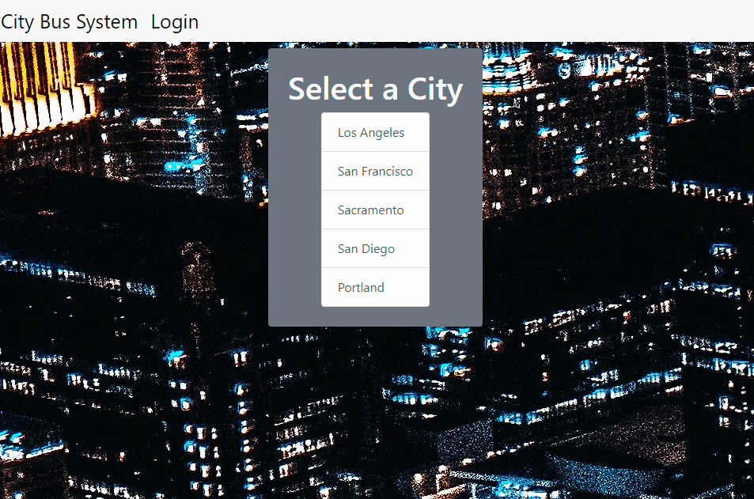

# City Bus System

This application is intended to empower growing communities to serve their citizens using public transpotation. This scalable database will provide a framework for city planners to improve the conditions for their constituents.

## Technologies:

* HTML
* CSS
* Node.js
* Express.js
* Express-Handlebars.js
* Express-Sessions.js
* Sequelize.js
* dotenv.js
* bcrypt

## Description:

This application empowers an administrator to build a public transportation network. The idea being that one can add routes, add stops, to a database that is viewable by the community it serves.

## Installation:

* ### From the Deployed Link:
    * On your browser, navigate to [City Bus System](https://harshs-bus-system.herokuapp.com/).
    * The Citezens will be able to view routes and stops that exist in their city.
    * An administrator can create a username and password.
    * Now you are ready to create, modify and delete routes and stops in the city.

* ### From The GitHub respository:
    * First go to [City Bus System](https://github.com/hmanjun/City-Bus-System) and clone the code onto your local machine.
    * Next navigate to the newly cloned ```City-Bus_System``` file in your Command Line Interface.
    * Now type ```npm install``` to download all dependanciies.
    * Then type ```mysql -u root -p 'password'``` to connect to your MySQL shell.
    * Now type ```source ./db/shcema.sql``` to creat the database on your local machine.
    * That done you'll type ```quit``` to exit ```mysql```.
    * Next type ```node server.js``` to connect the application to your local host allowing you to view the webpade in your browser.

## Video of site in action:

[City Bus Sytem]()

## Code Snippet of significance:

### Login

* ``` ```

## Contributions:

Are welcome! please use this application to make the world a better place! Just follow the terms of the MIT License.

## Contributors:

* [Harshith Manjunatha](https://github.com/hmanjun)
* [Austin Parks](https://github.com/apark0819)
* [James Bennett](https://github.com/apark0819)


